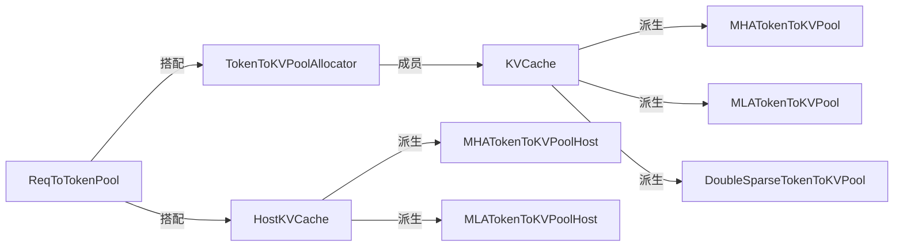
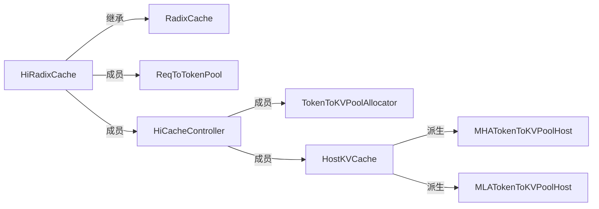
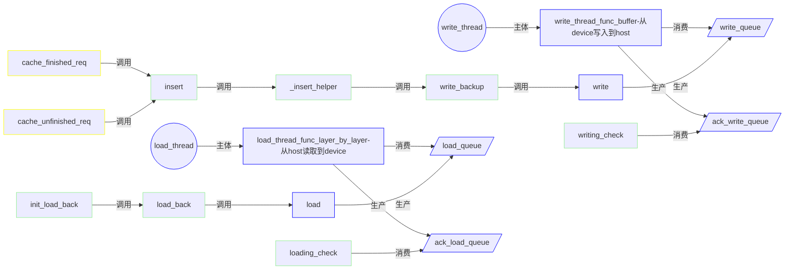
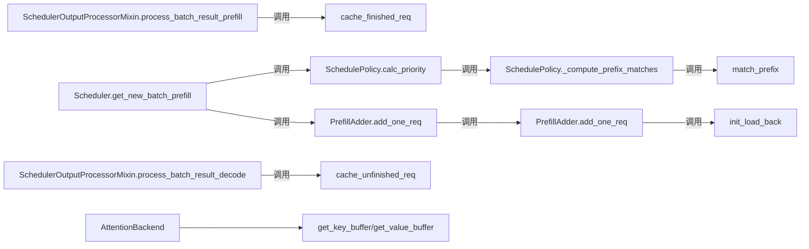
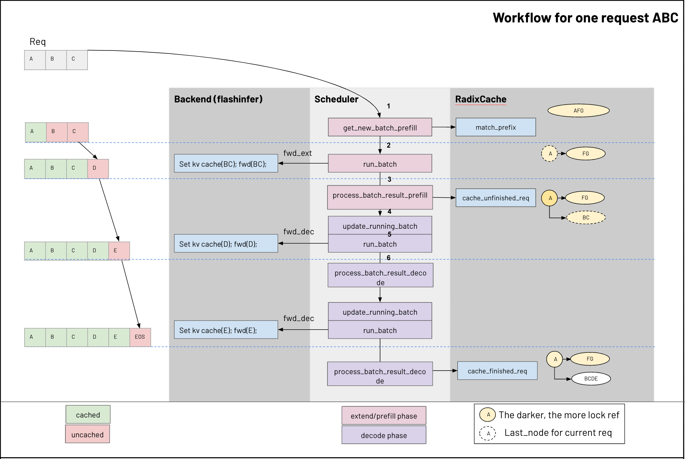

# KV Cache 代码梳理
本文档围绕kvcache的调用过程和设计思路，对相关源码进行梳理，建议结合子仓库源码的代码注释笔记一起阅读。

源码：以submodule方式在本仓库进行管理，里面注释的笔记部分会用 `<NT>` 标记，可以搜索查看。

版本：note-20350326，对应原sglang仓库main分支的 d89c0e4b7ed3b9d4b119cf66544765cc4c7adadb

注意：本仓库的sglang submodule的版本会更新，里面以注释形式存在的笔记也会更新，但本文档并不一定会更新，如版本相差太多，导致一些细节对不上，可尝试拉取老版本的分支进行阅读。

## 目录
- [引言](#引言)
- [关键源码存放位置](#关键源码存放位置)
- [内存池](#内存池)
  - [ReqToTokenPool](#ReqToTokenPool)
  - [TokenToKVPoolAllocator](#TokenToKVPoolAllocator)
  - [KVCache](#KVCache)
  - [HostKVCache](#HostKVCache)
- [Request间前缀复用-RadixCache](#Request间前缀复用-RadixCache)
- [KVCache的Offload功能-HiRadixCache](#KVCache的Offload功能-HiRadixCache)
  - [HiCacheController](#HiCacheController)
  - [HiRadixCache](#HiRadixCache)
  - [关键函数与变量的关系梳理](#关键函数与变量的关系梳理)
- [模块交互](#模块交互)
- [参考](#参考)

## 引言

在 Transformer 的自回归生成过程中，模型每次预测一个 token 并逐步扩展序列。由于自注意力机制在计算当前 token 时仍需访问所有历史 token 的信息，如果每次生成都重新计算整个序列的键值矩阵（Key/Value），会导致大量冗余计算。

KVCache 的核心思想是缓存历史时间步的键值对（K/V）：在生成第 t 个 token 时，只需计算当前 token 的 K/V，而历史 token 的 K/V 直接复用缓存，从而大幅降低推理延迟。

## 关键源码存放位置

```plaintext
ai-infra-notes
└── sglang 
    └── python
        └── sglang
            └── srt
                ├── managers
                |   └── cache_controller.py
                └── mem_cache
                    ├── chunk_cache.py
                    ├── hiradix_cache.py
                    ├── memory_pool.py
                    └── radix_cache.py
```

## 内存池 

源码: mem_cache/memory_pool.py

KV Cache的内存管理主要涉及三层，分别是 `ReqToTokenPool`，`TokenToKVPoolAllocator`和`KVCache`。另外针对kvcache的多层级offload，还设计了一个`HostKVCache`。



### ReqToTokenPool
- **介绍：** 管理 Request 的槽位，负责从 Request 到 token 位置的映射，里面存放的元素是 Request 所属的 token 在 `TokenToKVPoolAllocator` 的槽位的索引。因为token id数值范围很广也乱，不能直接用于内存索引，所以需要动态地将token id转为实际存放的索引: kv_indices
- **创建：** 初始化参数 size 表示最大允许Request数，max_context_len 表示每个req最大允许的token数。在`ModelRunner.init_memory_pool`里创建， 在`Scheduler`和`ScheduleBatch`里会对其进行相关操作。关键操作在`ScheduleBatch`里。
- **内存布局：** [size, max_context_len], int32
- **主要函数：** 
  - `alloc`：在ScheduleBatch.prepare_for_extend->alloc_req_slots里调用，会根据该batch有多少个req，从而调用alloc拿到相应数量的slot空槽位下标。
  - `write`：在 ScheduleBatch.prepare_for_extend 和 prepare_for_decode 里调用，入参`indices`是二维列表，行是从`alloc`函数获得到req的槽位索引，列是req内的逐个token顺序位置。入参`values`则是token对应的kvcache存放位置。
  - 

### TokenToKVPoolAllocator
- **介绍：** 管理 token 的槽位，负责从 token 到实际 kvcache 内存索引的映射，根据里面存放的数据可以找到任意 token 对应的 KVCache 的内存块。
- **创建：** 初始化参数 size 是 `max_total_num_tokens`
- **内存布局：** 一维size长度的int64数组
- **主要函数：** 
  - `alloc`：按token数申请空槽位，返回的是充当下标的tensor，在set_kv_buffer函数中作为loc参数输入，里面每个元素表示的是token的kvcache存放的下标，对应该轮ScheduleBatch计算的输出结果。
  - `get_kvcache`：KVCache 被创建后会被作为成员在这里被管理。

### KVCache
- **介绍：** 管理实际的 kvcache 内存，通过 `TokenToKVPoolAllocator` 拿到的 token 对应的内存索引，可以取出其对应的kvcache数据。在实际使用时，会根据特定模型选择子类 `MHATokenToKVPool`, `MLATokenToKVPool` 还是 `DoubleSparseTokenToKVPool`。
- **创建：** 初始化参数 size 是 `max_total_num_tokens`
- **内存布局：** layer_num * max_total_num_tokens * head_num * head_dim (以MHA为例)
- **主要函数：** 
  - `get_kv_buffer`：在attention的推理backend中调用，取出对应层的kvcahe，充当计算kernel的输入之一。
  - `set_kv_buffer`：也是在attention的推理backend中调用，将计算结果填入kvcache内存池中。如`forward_batch.token_to_kv_pool.set_kv_buffer(layer, forward_batch.out_cache_loc, k, v)`，out_cache_loc 是从 TokenToKVPoolAllocator.alloc 中得到的。

### HostKVCache
- **介绍：** 管理host端的kvcache内存，除此之外与普通的 `KVCache` 不同点还有它兼顾了 `TokenToKVPoolAllocator` 的功能，管理了token的槽位！子类对应 `MHATokenToKVPoolHost` 和 `MLATokenToKVPoolHost`。


## Request间前缀复用-RadixCache
源码: mem_cache/radix_cache.py

上面讲了内存池基本概念，一个request通过两层的跳转，可以找到对应的kvcache，不需要重复计算，自然而然地实现复用。因为kvcache的存储是分层按token划分的，如果不同Request之间拥有相同的前缀，前缀部分计算结果也会是一样的，所以也应能实现复用。

这节梳理的是Request之间的前缀复用的方式，主要通过基数树来实现，也称压缩前缀树。

### TreeNode
- **介绍：** 压缩前缀树的节点类，在`RadixCache`中使用
- **成员：** | key：token id | value: kv_indices |
- **函数：** `__lt__` ，表示节点使用last_access_time作为大小比较的依据，last_access_time越小，表示节点越小, 在节点驱逐淘汰时，会对节点进行排序，淘汰掉近期未被使用过的数据。

### RadixCache
- **介绍：** 前缀复用的核心实现类，基本的思路是基于上面的`TreeNode`，构建压缩前缀树，对`ReqToTokenPool`和`TokenToKVPoolAllocator`进行管理。当内存池满时，使用LRU淘汰策略。
- **主要函数：** 
  - `match_prefix`：输入要查找的token id列表，返回能在`TokenToKVPool`中找到的token_id对应kvcache的kv_indices索引，以及匹配前缀命中的最后一个节点last_node。这个last_node 给出去主要是提供一个快速检索的入口，当要再次检索节点时，不需要重新匹配，基于last_node往parent方向可以找出所有前缀token。
  - `inc_lock_ref`：增加节点被使用的计数，大于0表示正在被使用。基于子节点req.last_node，遍历所有前缀节点，并使计数lock_ref都加1。如果遍历到某个节点，其本身被标记为lock_ref==0，表示在这之前未被seq所使用，处于可驱逐状态。而现在需要将其从可驱逐状态转为保护状态，所以evictable_size_会减少，对应protected_size_增加。
  - `dec_lock_ref`：与`inc_lock_ref`相对应，减少计数，计数降为0，表示该节点当前未被使用。
  - `cache_finished_req`：当req结束时调用，按token_ids的长度从req_to_token_pool里取出该req所有token的kvcache索引。同时执行`insert`操作，将该req的新计算得到的未被插入树中的部分添加进去, 并释放req_to_token_pool。与`ChunkCache`相比，关键是少了token_to_kv_pool的整体释放，使跨req能复用。
  - `cache_unfinished_req`：与`cache_finished_req`相对应，在req未完成，调用。
  - `evict`：驱逐：根据num_tokens的数量，从树中驱逐相应数量的token，为准备加入的新token腾位置。首先收集树的叶子节点，构建小顶堆，则堆顶的是last_access_time最小者。并从小到大逐个pop出，进行检索。如果pop出的叶子节点目前未被使用, 则对其做释放处理，并累计释放的节点中，包含的token数量(num_evicted).使驱逐淘汰的token数量达到num_tokens。
  - `insert / _insert_helper`： 
    ```python
      # <NT> 外层通过insert函数进入。随后该函数会递归调用自身，直到完成插入。
      # 首先判断该节点的众多子节点中，是否有包含key[0](如page_size>1, 则第一个key改成第一个page)
      #    如有：
      #         取出key[0]所在的子节点child，以child为起始点，通过_key_match计算出于key相重叠的部分有多长 prefix_len
      #         如果prefix_len长度等于child节点上的key的总长度：
      #             表示二者的前缀涵盖了子节点child上所有的key。
      #             如果prefix_len长度等于正匹配的key的总长度：
      #                 表示二者的前缀同样也涵盖了插入的key，即要插入的key已完全被加入缓存了，不再需要任何其他操作
      #             否则：
      #                 表示要插入的key有一部分没有被缓存。所以从key中剔除掉已被缓存的头prefix_len个token，
      #                 取出未被缓存的部分key和value，基于child节点为基础上进入插入操作。
      #         否则：
      #             表示二者的前缀也未涵盖子节点child上的所有key，则需要对child子节点做分裂操作。
      #             如child节点有key为abcd，需要匹配的key为abef，有前缀ab，未完全覆盖节点上的key，此时需要对节点进行分裂。
      #             即有 child[abcd] <=_split_node=> 父 new_node[ab] -> 子 chile[cd]
      #             随后在 new_node[ab] 下继续往下递归插入未匹配部分的ef。
      #    (上面"如有"内部各分支都有return，不会继续往下走)
      #    如无：
      #         新增一节点存放需要匹配的key，并充当当前节点的子节点。
      #         key和value都是list，节点的parent只会有一个，所以直接指向node；
      #         而node的children因为会有很多个，按key列表中的首个token充当代表，作为children的索引。
    ```
  - `_split_node`： 
    ```python
      # <NT> 调用 new_node = self._split_node(child.key, child, prefix_len)
      # 如child节点有key：abcd，需要匹配的key为abef，有前缀ab，未完全覆盖节点上的key，此时需要对节点进行分裂。
      # 函数参数：key为abcd，child是节点本身，split_len将会是前缀2
      # new_node.key: ab, 只留存前缀匹配部分。value也一样只留存前缀匹配的部分。key是token id，而value是token在kvcache的存放位置，二者一一对应，所以也可以用相同的长度进行截取。
      # new_node.children: 子节点是原分裂前的节点child，其词典key被设为c，即非匹配部分的首个key值，child.key自然就是cd了。
      # child[abcd]  分裂 ==>> 父 new_node[ab] -> 子 chile[cd]  返回父节点
    ```

## KVCache的Offload功能-HiRadixCache
源码: mem_cache/hiradix_cache.py, mem_cache/hiradix_cache.py

`HiRadixCache`中的Hi是hierarchical的意思，针对kvcache只缓存在显存上导致显存压力大的问题，将kvcache的存放位置额外扩展到内存和磁盘(暂未支持)。

主要涉及几个类, 它们关系如下：



### HiCacheController
- **介绍：** 对应变量`cache_controller`，负责kvcache在显存和内存之间的交互。
- **关键变量：**
  - `write_queue`: 写队列，负责从device写到host。
  - `load_queue`: 读队列，负责从host加载数据到device。
  - `write_thread`: 写线程，调用`write_thread_func_buffer`函数，消费write_queue的数据。
  - `load_thread`: 读队列，调用`load_thread_func_layer_by_layer`函数，消费load_queue的数据。
  - `ack_write_queue` / `ack_load_queue`：用于标记操作是否已完成。
- **主要函数：**
  - `write`: 从host端分配token空槽位，并将这些新的空槽位保护起来，因为拷贝是异步的，以免中途再次被修改。将host_indices和device_indices使用CacheOperation关联起来，表示这是同一批数据。需要将host_indices上的host数据转移到device_indices上的device显存中。write执行后，write_queue会有数据，而初始化时创建的write_thread就会接收到数据，异步执行拷贝操作。是`write_queue`的生产者。
  - `load`: 与上面的write相对应，是`load_queue`的生产者。这里的`write`和`load`函数会在`HiRadixCache`类中被使用。
  - `write_thread_func_buffer`: 是`write_thread`的执行主体，将数据从显存拷贝内存中。首先会为write操作准备缓冲区用于凑数据，基本做法是当数据量太少时，不急于拷贝，等凑到一定量再拷。如果数据量太大，则需要分开多次拷贝，以免产生过多中间内存。
  - `load_thread_func_layer_by_layer`: 是`load_thread`的执行主体，采用逐层拷贝的方式进行，从内存到显存，加载一层算一层并同时加载第二层，使拷贝和计算相重叠。

### HiRadixCache
- **介绍：** 继承于`RadixCache`，并额外添加了`HostKVCache`和`HiCacheController`及其相关操作，扩展多层级kvcache offload。
- **主要函数：**
  - `write_backup`: 将要写的数据通过cache_controller提交到队列中，返回host内存的索引，并标记到node.host_value中。如果没有返回索引，则表示host的内存池里没有空槽位，需要先清除掉一些数据挪腾位置出来，再进行上面的操作。因为是异步拷贝，所以使用ongoing_write_through去记录正在拷贝的节点，拷贝结束再清除。
  - `load_back`: `write_backup`是单个节点的写入，`load_back`是以last_node为起点，往parent方向的整条前缀路径的所有节点的加载。
  - `writing_check`: 检查清理 write_backup 中启动的已完成的写回操作。
  - `loading_check`: 与`writing_check`一致，清理已启动已完成的加载操作。 
  - `evict`: 大体与 RadixCache.evict 一样，先收集树的叶子节点构建小顶堆，并从小到大逐个pop出，进行检索。主要差别在 if x.host_value 部分，这里的 write_policy 目前版本默认是 "write_through_selective"，如果 x 的数据没有被写入到 host 端，则直接释放显存并删除节点。如果 x 的数据有被写入到 host 端，则删除device数据，保留host端备份。
  - `_insert_helper`： 
    ```python
    # <NT> 节点插入的关键函数，可以先看RadixCache的_insert_helper注释。
    # 先查看待插入的token能否找到直接对应上的节点(pagesize为1，节点以key[0]作为词典的key)
    # 如果有:
    #   看前缀长度是否等于要插入的token。
    #   如果等于，即是能全匹配该节点：
    #     查看节点是否为evicted，
    #     如果是，表示该节点的device数据已经被同步到了host端。需要重新填充device数据，并更新host对应位置的状态。
    #     否则执行inc_hit_count表示该节点被命中次数+1，达到阈值后会被备份到host。
    #     并继续把待插入token剩下部分递归执行插入操作。
    #   否则是部分匹配，则需要分裂节点
    ```

### 关键函数与变量的关系梳理

蓝框在 `HiCacheController` 内，绿框在 `HiRadixCache` 内，黄框在 `RadixCache`。



## 模块交互

kvcache的入口主要是：match_prefix / cache_finished_req / cache_unfinished_req / init_load_back / get_key_buffer / get_value_buffer



另借用[kvcache-code-walk-through](https://github.com/zhaochenyang20/Awesome-ML-SYS-Tutorial/tree/main/sglang/kvcache-code-walk-through)一图，可以基本理清大致关系。



## 参考
1. https://github.com/zhaochenyang20/Awesome-ML-SYS-Tutorial/tree/main/sglang/kvcache-code-walk-through
2. https://zhuanlan.zhihu.com/p/31160183506
3. https://zhuanlan.zhihu.com/p/17186885141